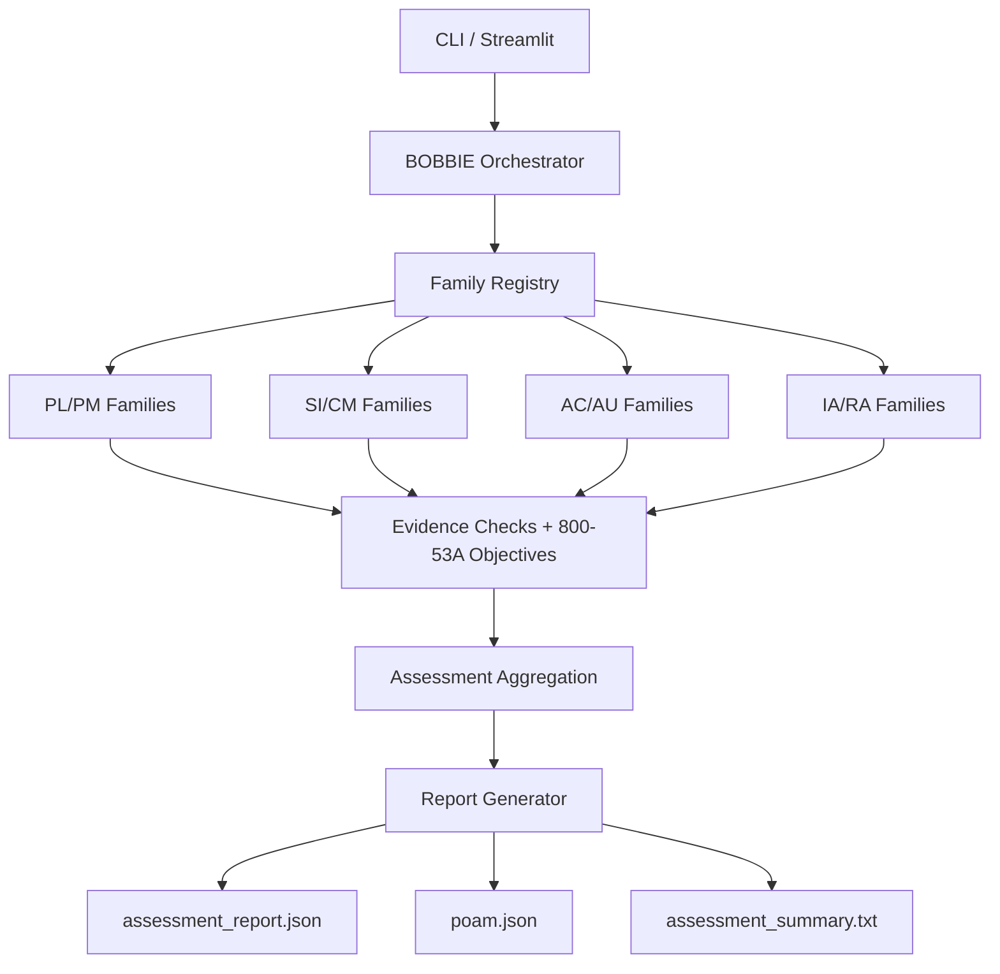

# BOBBIE

BOBBIE is a family-agent federal compliance assessment engine for NIST SP 800-53 Rev 5 controls.

## What it does

- Routes controls through family-level agents (20-family architecture target).
- Executes a 10-control demo scope across 8 active families.
- Produces deterministic, evidence-driven findings and objective-based effectiveness checks.
- Exports assessment artifacts: report JSON, POA&M JSON, and human-readable summary.

## Demo Scope (10 Controls)

- PL-2
- PM-9
- SI-4
- CM-8
- SI-2
- AC-2
- AC-7
- AU-3
- IA-5
- RA-5

## Architecture



## Repository Layout

```
src/
	agents/        Family agents + orchestrator
	models/        Data models and control schemas
	parsers/       OSCAL and EVTX parsers
	tools/         Evidence/objective checks and AWS helpers
	utils/         Reporting and support utilities
data/
	demo_frozen/   Frozen context and expected snapshots
	mock/          Mock datasets for control evidence
scripts/
	validate_demo_env.py
	run_dry_runs.py
	freeze_demo_snapshots.py
tests/           Unit/integration tests
app.py           Streamlit demo UI
run_assessment.py CLI entrypoint
```

## Prerequisites

- Python 3.10+
- macOS/Linux shell
- Optional AWS credentials (only needed for live AWS integration checks)

## Setup

```bash
python -m venv .venv
source .venv/bin/activate
pip install -r requirements.txt
```

## Run (CLI)

Default run:

```bash
python run_assessment.py
```

Deterministic run with explicit output folder:

```bash
python run_assessment.py \
	--deterministic \
	--output-dir artifacts/demo_run \
	--system-name "BOBBIE Demo System" \
	--control-timeout-seconds 30 \
	--max-workers 8
```

## Run (Streamlit)

```bash
streamlit run app.py
```

Then configure in the sidebar:
- deterministic mode
- timeout/worker settings
- optional uploaded JSON evidence
- optional catalog override

## Validation and Rehearsal Scripts

Validate environment and required files:

```bash
python scripts/validate_demo_env.py
```

Run 3 deterministic dry-runs and generate a report:

```bash
python scripts/run_dry_runs.py
```

Freeze expected snapshot outputs:

```bash
python scripts/freeze_demo_snapshots.py
```

## Testing

```bash
pytest -q
```

## Artifacts

Typical output files:

- `artifacts/**/assessment_report.json`
- `artifacts/**/poam.json`
- `artifacts/**/assessment_summary.txt`
- `artifacts/dry_runs/dry_run_report.md`

## Submission Assets

- Demo script: `DEMO_SCRIPT.md`
- Submission checklist: `SUBMISSION_CHECKLIST.md`
- Build plan tracker: `BOBBIE_Build_Plan.md`

## License

This project is licensed under the MIT License. See `LICENSE`.
