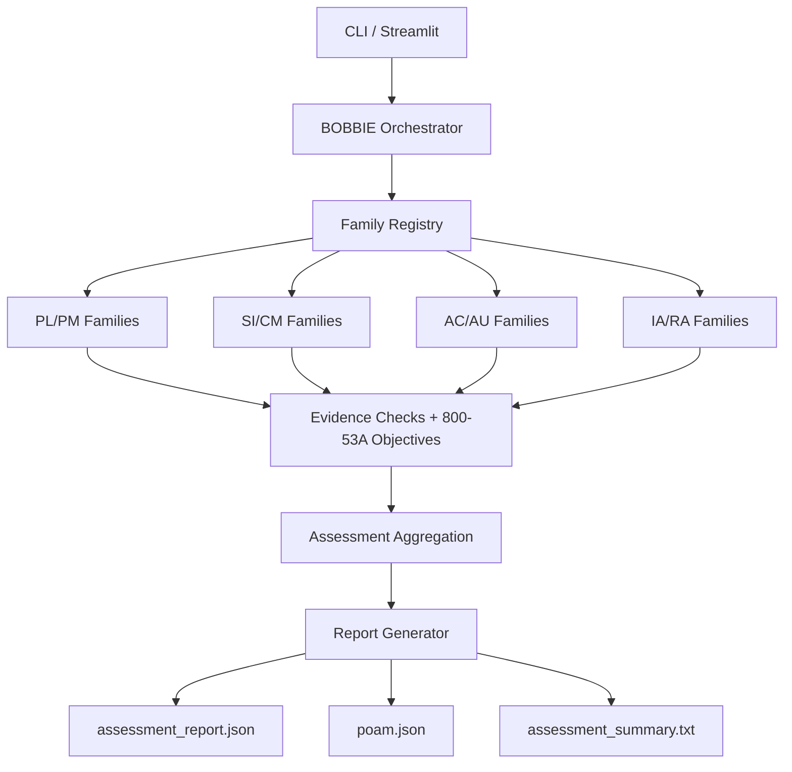

# B.O.B.B.I.E Architecture

```mermaid
flowchart TD
		A[CLI / Streamlit] --> B[BOBBIE Orchestrator]
		B --> C[Family Registry]
		C --> D1[PL/PM Families]
		C --> D2[SI/CM Families]
		C --> D3[AC/AU Families]
		C --> D4[IA/RA Families]
		D1 --> E[Evidence Checks + 800-53A Objectives]
		D2 --> E
		D3 --> E
		D4 --> E
		E --> F[Assessment Aggregation]
		F --> G[Report Generator]
		G --> H1[assessment_report.json]
		G --> H2[poam.json]
		G --> H3[assessment_summary.txt]
```
