# B.O.B.B.I.E. Concept of Operations (CONOPS)

**System:** Bedrock-Orchestrated Baseline & Behavior Intelligence Engine (B.O.B.B.I.E.)
**Document type:** Concept of Operations
**Status:** Living document — update at major phase milestones
**Source of truth for scope/status:** [PROJECT_STATUS.md](PROJECT_STATUS.md), `BOBBIE_Build_Plan.md`

---

## 1. Purpose

This Concept of Operations (CONOPS) describes—in operational, non-implementation terms—how
B.O.B.B.I.E. is used to perform federal compliance assessments against NIST SP 800-53 Rev 5
controls. It defines the system's mission, operating context, stakeholders, operational
scenarios, and the flow of work from evidence collection to remediation-ready artifacts. It is
intended for assessors, system owners, engineering reviewers, and evaluators who need to
understand *what the system does and how it is operated* before reading the technical
architecture in [architecture.md](architecture.md).

## 2. Scope

- **In scope:** Automated, deterministic assessment of a defined set of NIST 800-53 Rev 5
  controls; evidence-driven findings; objective-based (800-53A) effectiveness checks;
  AI-augmented risk narratives and remediation guidance; and export of machine- and
  human-readable assessment artifacts.
- **Current demo scope:** 10 controls across 8 active control families — PL-2, PM-9, SI-4,
  CM-8, SI-2, AC-2, AC-7, AU-3, IA-5, RA-5.
- **Target scale:** A 20-family agent architecture, with controls routed through
  family-level agents.
- **Out of scope (current):** Continuous/real-time monitoring, automated remediation
  execution, authorization-to-operate (ATO) workflow management, and non-AWS infrastructure
  collectors beyond the supported sources.

## 3. Mission and Objectives

**Mission:** Give federal compliance teams faster, repeatable, and defensible control
assessments by combining deterministic evidence evaluation with AI-augmented narrative and
remediation guidance.

**Operational objectives:**

1. Produce the same finding for the same evidence on every run (determinism and auditability).
2. Ground every finding in collected evidence and 800-53A assessment objectives.
3. Isolate control-level failures and timeouts so one control cannot fail the whole run.
4. Emit remediation-ready outputs (POA&M items) that can be handed directly to engineering.
5. Keep AI suggestions advisory and auditable — never silently overriding evidence-based results.

## 4. Operational Context

B.O.B.B.I.E. operates as an on-demand assessment engine rather than a continuously running
service. An operator initiates an assessment run; the system collects an infrastructure
snapshot, routes each in-scope control to its family agent, evaluates evidence against control
objectives, aggregates results, and writes artifacts to an output directory. The engine can be
driven from a command-line entrypoint or a web UI, and can run fully offline against frozen or
mock data when live cloud access is unavailable.

### Operating modes

| Mode | Description | Primary use |
|---|---|---|
| **Deterministic** | Fixed control ordering and stable outputs for identical inputs | Demos, regression, audit reproduction |
| **Live infrastructure** | Collects a snapshot from live AWS via boto3 | Real assessments against deployed environments |
| **Offline / frozen** | Uses frozen context and mock datasets | Demos and CI without cloud credentials |
| **AI-narrative** | Adds LLM-generated risk narratives and remediation text | Richer reporting; suggestions remain advisory |
| **Collect-only** | Captures and saves an infrastructure snapshot without assessing | Pre-staging evidence; separating collection from analysis |

### Infrastructure data sources

Live boto3 API calls (default), Terraform state files, AWS Config snapshots, and
CloudFormation/CDK stack enumeration. Source selection is an operator choice at run time.

## 5. Stakeholders and Roles

| Role | Responsibility |
|---|---|
| **Assessor / Operator** | Initiates runs, selects mode and data source, reviews findings and artifacts |
| **System Owner** | Owns the assessed environment; receives findings and POA&M items for remediation |
| **Engineering / Remediation** | Consumes machine-readable artifacts to implement fixes |
| **Reviewer / Evaluator** | Verifies determinism, evidence grounding, and artifact completeness |
| **Maintainers** | Extend family agents, evidence checks, collectors, and objective mappings |

## 6. System Capabilities (Operational View)

- **Family-based routing:** Controls are dispatched to the agent for their control family,
  enabling independent buildout and scaling toward the 20-family target.
- **Deterministic evidence checks:** Each control is evaluated against collected evidence with
  reproducible logic.
- **Objective-based effectiveness:** Findings are mapped to NIST 800-53A assessment objectives.
- **Fault isolation:** Per-control timeouts and failure handling keep a single control's
  problems from cascading.
- **Aggregation and scoring:** Individual findings are rolled up into an overall compliance
  posture and prioritized findings list.
- **AI augmentation (advisory):** Optional LLM-generated narratives and remediation guidance,
  with confidence thresholds and explicit opt-in before any suggestion is auto-applied.
- **Artifact export:** Produces `assessment_report.json`, `poam.json`, and
  `assessment_summary.txt`, plus a saved infrastructure snapshot.

## 7. Operational Scenarios

### Scenario A — Standard deterministic assessment (CLI)

1. Operator prepares the environment and selects an infrastructure source.
2. Operator runs the assessment in deterministic mode with a chosen output directory.
3. The system collects/loads an infrastructure snapshot and reports resource counts.
4. The orchestrator routes each in-scope control to its family agent.
5. Family agents evaluate evidence against control objectives and return findings.
6. Results are aggregated into a compliance score and prioritized findings.
7. Artifacts are written to the output directory and a summary is printed.

### Scenario B — Web UI assessment

1. Operator starts the API server and frontend.
2. Operator configures the run and triggers it from the UI.
3. Results and downloadable artifacts are presented in the browser.

### Scenario C — Offline / demo run

1. Operator uses frozen context and mock datasets (no cloud credentials required).
2. The system runs deterministically and produces the same expected artifacts each time,
   suitable for demos, CI, and regression checks.

### Scenario D — AI-augmented assessment with safety controls

1. Operator enables narrative generation (and optionally suggestion auto-apply).
2. The system attaches advisory narratives and, per control, a suggestion object containing
   suggested status, suggested risk, confidence, and an explanation.
3. Auto-apply occurs only when explicitly enabled and confidence meets the threshold; original
   status and risk are preserved for auditability.
4. Reviewers inspect suggestions against deterministic evidence before accepting them.

### Scenario E — Collect-only snapshot

1. Operator runs in collect-only mode to capture and save an infrastructure snapshot.
2. The snapshot is retained for later assessment or evidence review without running analysis.

## 8. Operational Workflow

```mermaid
flowchart LR
    A[Operator initiates run] --> B[Select mode + infrastructure source]
    B --> C[Collect / load infrastructure snapshot]
    C --> D[Orchestrator routes controls by family]
    D --> E[Family agents: evidence + 800-53A objective checks]
    E --> F[Aggregate findings + compliance score]
    F --> G[Optional AI narrative / suggestions advisory]
    G --> H[Export artifacts]
    H --> I[Assessor review]
    I --> J[Remediation / POA&M handoff]
```

## 9. Inputs and Outputs

**Inputs**

- Infrastructure snapshot (live AWS, Terraform state, AWS Config, or CloudFormation).
- Assessment context (control evidence, EVTX/log data, AWS metadata, frozen/mock datasets).
- Run configuration (mode, output directory, system name, timeouts, concurrency, LLM options).

**Outputs**

- `assessment_report.json` — full machine-readable findings and scoring.
- `poam.json` — Plan of Action & Milestones items for remediation tracking.
- `assessment_summary.txt` — human-readable summary.
- `infra_snapshot.json` — captured infrastructure snapshot.

## 10. Assumptions, Constraints, and Dependencies

- Live assessments require valid AWS credentials; absent credentials, the system falls back to
  frozen/mock data with graceful degradation.
- Determinism depends on stable inputs; changing evidence or data sources changes findings.
- AI narratives/suggestions are advisory and must not be treated as authoritative without
  human review of the supporting evidence.
- The system runs on Python 3.10+ in a macOS/Linux shell environment.

## 11. Operational Safeguards

- AI suggestion auto-apply is **off by default** and gated by a confidence threshold.
- When a suggestion is applied, the original status and risk level are recorded to preserve the
  audit trail.
- Per-control timeouts and failure isolation prevent a single control from compromising the run.
- Deterministic mode and frozen snapshots enable reproducible verification and regression checks.

## 12. References

- [README.md](../README.md) — setup, run commands, and repository layout
- [architecture.md](architecture.md) — system architecture diagram
- [DEMO_SCRIPT.md](DEMO_SCRIPT.md) — 3-minute demonstration talk track
- [SUBMISSION_CHECKLIST.md](SUBMISSION_CHECKLIST.md) — submission readiness checklist
- [PROJECT_STATUS.md](PROJECT_STATUS.md) — current development status
